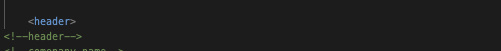
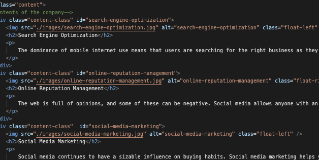
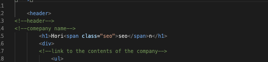

# Homework_Week1_
My homework BCS Week1

# Criteria.

* On this homework, I was given an original html and CSS file, which were already working as it should look like,
  but there were some codes I could've made it better. This process is called "Semantic mark-ups"

* Semantics refers to the correct interpretation of the meaning of a word or sentence.
  To use a word semantically is to use it in a way that is properly aligned with the meaning of the word.

* First, using HTML correctly. The tags themselves become a way to tell a machine (whether a browser, a computer, a smartphone, or another smart device) something about the meaning of the content. For example, this original html was using 
 instead of <header>. Of course, div tag works fine but machine understands it as 
 not <header>. Right html tag tells machines how important the word or sentence is. Also, using right tag makes it better for search engine also good for screen reader.

* Also, accessibility is important. It is very important that people with disability can understand the website correctly. Example from this homework, there was no alt attribute in any images. Without alt attribute, people who use screen reader cannot reach the information what the image is telling. So I added alt to each images.

* Although, clear coding is always important for maintenance the website. Even other programmer could come in and work with the code without confusion. In this homework, there was no comment on html file. Comment are easy for human to read and understand what this code is meaning, so I added few comments to make it clear. Also, there were multiple class attribute had same CSS code. There is no reason to make code meaninglessly longer. I put all those class under same name.  

# What I have leaned from this homework
   * From this homework, I learned how much work I can put into existing code and make it clear and easy for later. 

# Reference: 
* BREVITY  https://seekbrevity.com/
* HTML.COM https://html.com/semantic-markup/#ixzz6e708Kj
